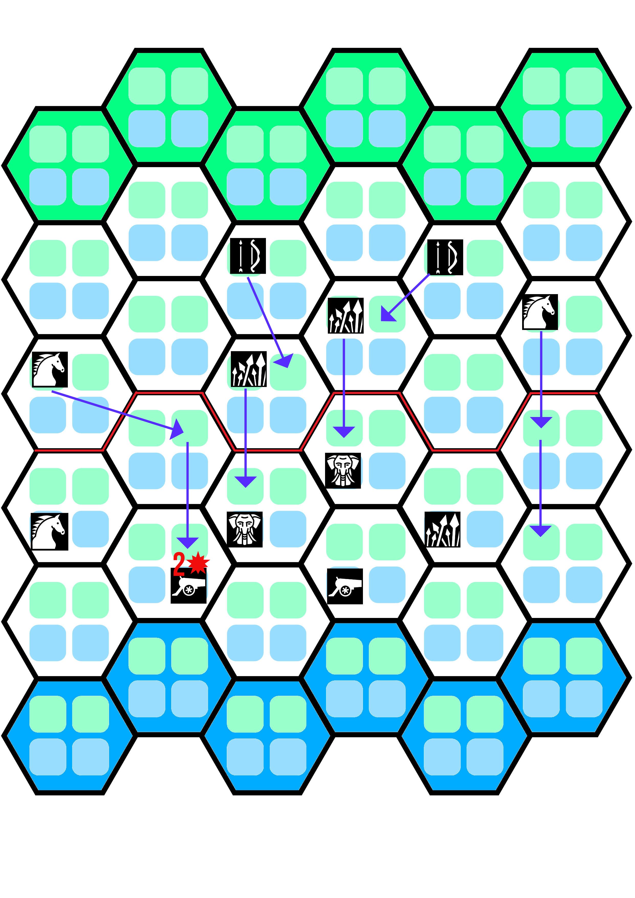
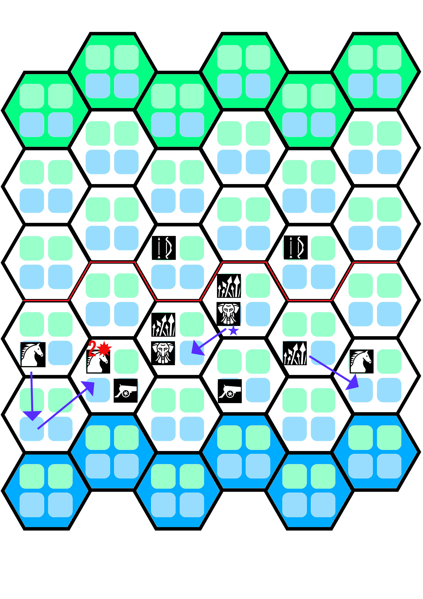
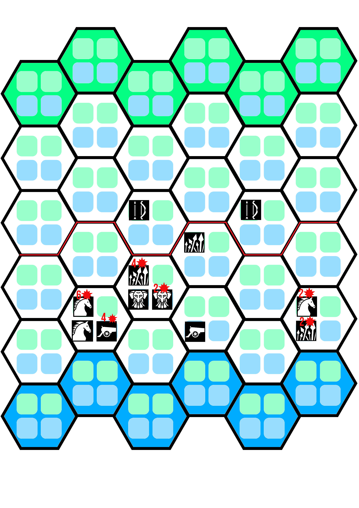
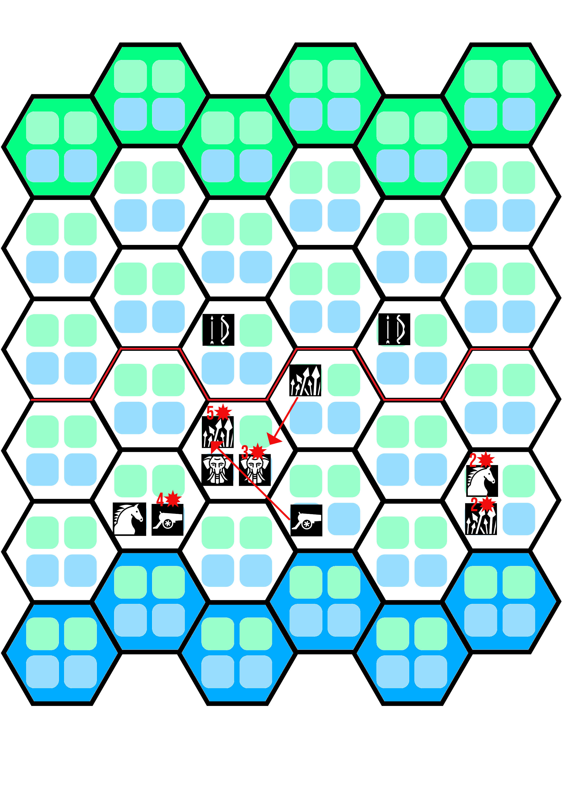
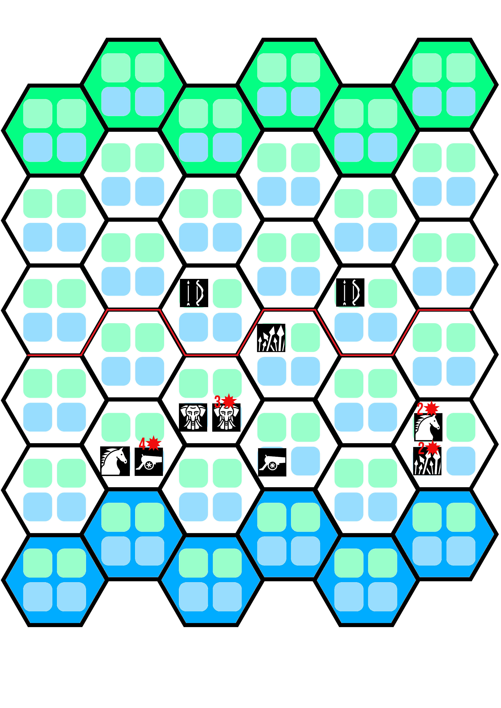

# Example round

Using the starting position suggested for the first game, let's play one full round!

### Faction phase: first player

In their turn the first player presses the center with the spears and archers, the right flank Mounted uses Charge to move to the castle. The left flank uses Charge to damage the opponent cannon.

### Faction phase: second player

The Assault Beast uses their Trample ability to move even if they're engaged in combat. The left flank Mounted unit charges the opponent Mounted unit, hoping to kill it this round. On the right flank, the Spears move to defend while supported by the other cannon.

### Resolution phase: combat

On the left flank, the first player's Mounted unit receives 4 damage to the 2 it already had. It is removed from combat. On the right flank, Spears and Mounted trade damage. On the center, the Spears deals 2 damage to an Assault Beast, and receives 4 damage.

### Resolution phase: abilities

Melee abilities resolve simultaneously first, and the Spears in the center use their Pierce to deal 1 damage to the Assault Beast.

Then, ranged abilities resolve simultaneously. The Cannon in the left flank cannot use their ability because they were engaged in combat this round. The second Cannon kills the Spear unit in the center. Neither of the Archers deal damage because they have moved and are not targeting the same units as last round.

### End of the round

The first player's reckless charge has lost them a unit, while the second player has damage sustained by multiple units. Still, that right flank is being threatened by the first player.

In the second round, the first player will use the Spears in the center to engage the Cannon, while on the right flank their Archer will kill the Spears after combat. How will the second player pivot their defences to avoid losing by sustaining 1 damage during two rounds?

