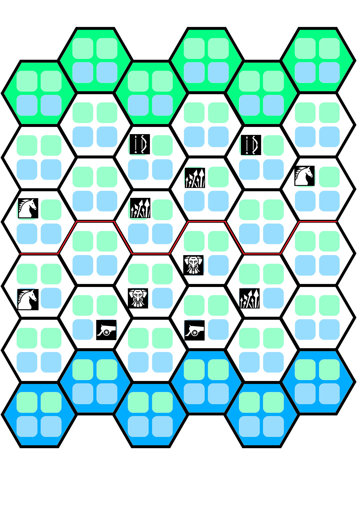

Smalltricks is a fast-paced board game for two players, where each side commands an army of six units on a 6x6 hexagonal battlefield. The goal is simple: outmaneuver your opponent and deal more damage to their castle before they do the same to you. Each game is quick, but every move counts, making for tense and exciting matches.

## Setup

To start, each player builds their own faction by choosing six units. There are different types—like Archers, Spears, Mounted, and more; each with unique abilities and strengths. Units can move across the board, engage in combat, or use special abilities depending on their type. Some units are better at fighting up close, while others can attack from a distance or have special abilities. You can mix and match, creating your own strategies and combos.

Once factions are chosen, each player secretly arranges their units on their half of the board, then reveal them simultaneously and get ready to play.

> For your first game, it is recommended that you start with the following factions and arrangements:
>
> First Player: 2 Mounted, 2 Spears, 2 Ranged
>
> Second Player: 1 Mounted, 1 Spear, 2 Assault Beasts, 2 Cannon
>
> 

## Playing the game

Gameplay happens in rounds. Each round, starting with the first player, each players alternate a Faction phase where they move all their units. Then, a Resolution phase happens for both.

During a faction phase each unit moves up to 1 hexagon. Only 2 units per faction can be in the same hexagon. If your unit ends up in the same space as an enemy, they’re "engaged in combat", end their movement and must fight during the Resolution phase.

If any unit receives 5 or more damage via combat or abilities it is immediately removed from the board.

After both players have activated all their units, the round’s Resolution phase begins. First, all battles are resolved simultaneously, where each unit deals 2 damage to opponent units split any way the players want.

> Example A: In the same hexagon, the first player has a Spear Unit with 2 damage and the second player has a Mounted unit with 3 damage. They deal 2 damage to each other. The unit from the second player has received 6 damage in total and is removed from the battlefield. The unit from the first player has received 4 damage and remains in play, barely alive!

> Example B: In the same hexagon, the first player has 2 Assault Beast units with 4 damage each and the second player has a Jester unit with no damage. The unit from the second player chooses to deal 1 damage to each opponent unit (instead of 2 to the same unit). It receives 4 damage from both units. Both units from the first played are removed from the battlefield. Good job, Jester!

After all combats are resolved, units that did not engage in combat use their abilities simultaneously: first both players resolve melee abilities, then ranged abilities. If a unit is in the enemy’s castle row and has not engaged in combat, it deals one damage to the castle.

> Example A: The first player has a Spear unit by an Archer unit from the second player with 4 damage. The Spear uses its Pierce ability to deal the 5th damage and remove the Archer unit from the battlefield. The Archer unit doesn't get to use its ranged ability.

> Example B: The first player has an Archer unit by a Mounted unit from the second player that is at the first player's castle, has not engaged in combat, and has 3 damage. The Archer uses its Volley ability to deal 1 damage to the Mounted unit. As the Mounted unit has not engaged in combat and is at an opponents's castle, it deals 1 damage to it. The second player is closer to winning.

A game ends at the end of a Round when either:

- a player’s castle receives 2 more damage than their opponent's
- a player's castle has had 1 more damage than their opponent's for two consecutive Rounds

> Example A: After a few of Rounds, the first player has two unengaged Spear units at the second player's castle while the second player has none. Both units deal 1 damage each, and the first player wins the game.

> Example B: After a few of Rounds, the first player has two unengaged Spear units at the second player's castle, but the second player has a Mounted unit of their own in the first player's castle. At the end of the Resolution phase, the first player's castle has received one damage, and the second player's has two damage. The game continues but it's not looking good for the first player.

> Example C: The first player's castle has 1 damage. At the end of the Resolution round, the first player's castle receives 1 damage, and the second player's another 1 damage. The first player loses the game because they've sustained 1 more damage than their opponent for two consecutive rounds.

After a game ends, restart the board, and alternate the first player role. If both players agree, you can redo your factions.

At the end of the afternoon, the player with the least wins has to bring the player with the most wins a beverage of their choice.
