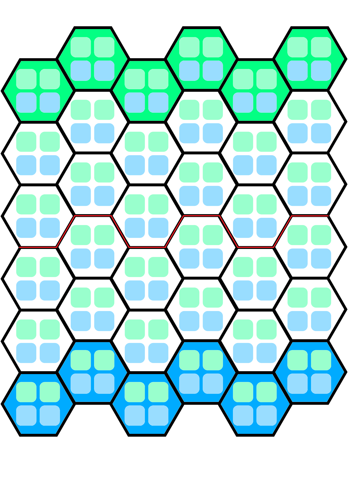

Smalltricks is a fast-paced board game for two players, where each side commands an army of six units on a 6x6 hexagonal battlefield. The goal is simple: outmaneuver your opponent and deal more damage to their castle before they do the same to you. Each game is quick, but every move counts, making for tense and exciting matches.

To start, each player builds their own faction by choosing six units. There are different types—like Archers, Spears, Mounted, and more; each with unique abilities and strengths. Units can move across the board, engage in combat, or use special abilities depending on their type. Some units are better at fighting up close, while others can attack from a distance or have special abilities. You can mix and match, creating your own strategies and combos.

Once factions are chosen, each player secretly arranges their units on their half of the board, then reveal them simultaneously and get ready to play.

[screenshot and example]

Gameplay happens in Rounds. Each round, starting with the first player, both players alternate turns moving all their units.

Each unit moves up to 1 hexagon. Only 2 units per faction can be in the same hexagon. If your unit ends up in the same space as an enemy, they’re "engaged in combat", end their movement and must fight during the Resolution phase.

If any unit receives 5 or more damage via combat or abilities it is immediately removed from the board.

[screenshot and example]

After both players have activated all their units, the round’s Resolution phase begins. First, all battles are resolved at once, where each unit deals 2 damage to opponent units simoultaneously, split any way they want.

[screenshot and example]

After all combats are resolved, units that did not engage in combat use their abilities simoultaneously: first both players resolve melee abilities, then ranged abilities. If a unit is in the enemy’s castle row and has not engaged in combat, it deals one damage to the castle.

A game ends at the end of a Round when either:

- a player’s castle receives 2 more damage than their opponent's
- a player's castle has 1 more damage than their opponent's for 2 Rounds

[example]

After a game ends, restart the board, and alternate the first player role.
